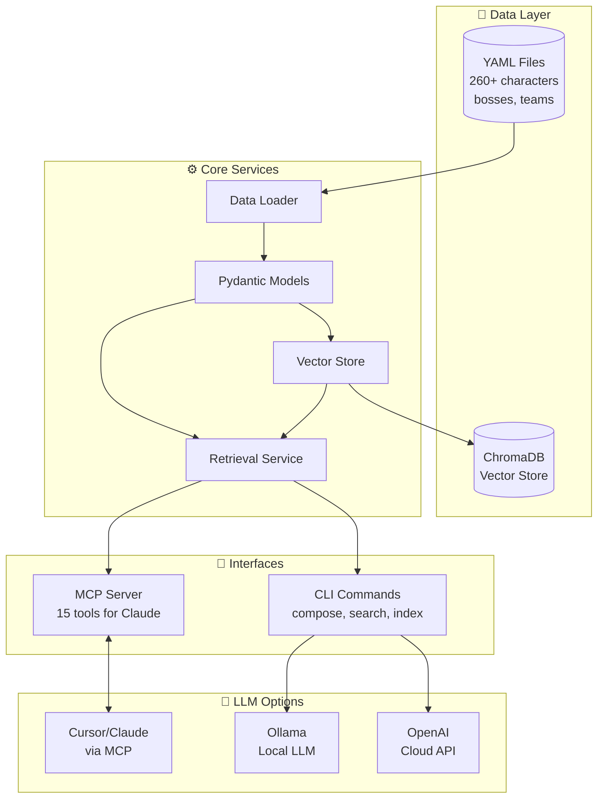
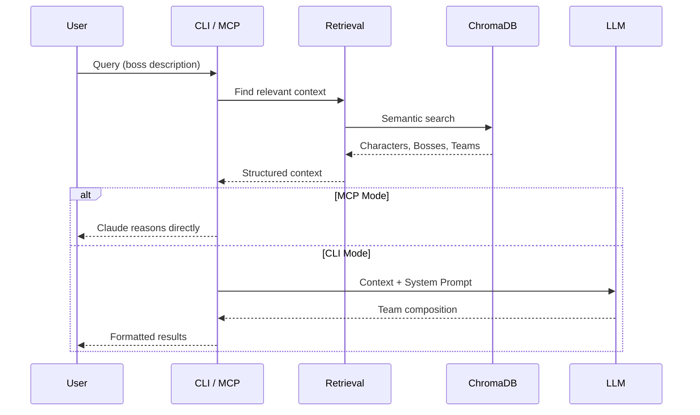

# COTC Tactician

AI-powered team composition assistant for **Octopath Traveler: Champions of the Continent**.

A local-first prototype combining human-editable game knowledge, vector-based semantic retrieval, and LLM-powered reasoning for team composition.

## Core Design Principle

```
┌─────────────────────────────────────────────────────────────────────────────┐
│  THE LLM KNOWS NOTHING ABOUT COTC                                           │
│                                                                             │
│  All character names, skills, passives, numbers, boss mechanics,            │
│  and meta knowledge MUST come from human-curated data files.                │
│                                                                             │
│  The LLM's role: REASON over provided data, never GENERATE game facts.      │
└─────────────────────────────────────────────────────────────────────────────┘
```

## Features

- **Human-Editable Data**: All game knowledge stored in YAML files (260+ characters, 270+ bosses)
- **Semantic Search**: Vector database for finding relevant characters/bosses/teams
- **MCP Server**: Use Claude in Cursor as your reasoning engine (no API costs!) - 15 tools
- **EX Fight Support**: Full schema for Adversary Log mechanics (EX1/EX2/EX3 variants)
- **Team Building**: Tank types, buff/debuff stacking categories, survival strategies
- **LLM Reasoning**: Alternatively use Ollama or OpenAI for team composition
- **Data-Grounded**: LLM cannot hallucinate game facts—only reasons from provided data
- **Local-First**: Runs entirely on your machine

## Quick Start

### 1. Install Dependencies

```bash
# Clone the repository
git clone https://github.com/example/cotc-tactician.git
cd cotc-tactician

# Create virtual environment
python -m venv .venv
source .venv/bin/activate  # On Windows: .venv\Scripts\activate

# Install with pip
pip install -e ".[all]"
```

### 2. Add Game Data

The system requires human-curated game data. Start by copying the templates:

```bash
# Copy character template
cp data/characters/_template.yaml data/characters/my-character.yaml

# Copy boss template
cp data/bosses/_template.yaml data/bosses/my-boss.yaml

# Copy team template
cp data/teams/_template.yaml data/teams/my-boss-team.yaml
```

Edit the YAML files with actual game data. See `data/*/_example-*.yaml` for format examples.

### 3. Index the Data

```bash
# Index game data into vector database
cotc-tactician index
```

### 4. Compose Teams

```bash
# With a known boss
cotc-tactician compose --boss example-boss

# With a description of an unknown boss
cotc-tactician compose --desc "Boss with party-wide nuke every 5 turns, weak to fire"

# With specific available characters
cotc-tactician compose --boss example-boss --chars "char1,char2,char3"
```

## Usage Options

### Option 1: MCP Server with Cursor (Recommended)

Use Claude in Cursor as your reasoning engine—no API costs!

```bash
# Start the MCP server
cotc-tactician mcp-serve
```

Configure Cursor by adding to `~/.cursor/mcp.json`:

```json
{
  "mcpServers": {
    "cotc-tactician": {
      "command": "cotc-tactician",
      "args": ["mcp-serve"]
    }
  }
}
```

Restart Cursor, then ask Claude things like:
- "Search for fire damage dealers in COTC"
- "Get details on the character primrose-ex"  
- "Find characters that hit sword and fire weaknesses"
- "Suggest a team for a boss weak to ice and dagger"
- "Get info on arena-tikilen and its EX variants"
- "Find provoke tanks for my team"
- "Plan a team for 120npc-dignified-tutor"
- "Check buff coverage for richard, viola, solon"

### Option 2: Local LLM (Ollama)

Requires [Ollama](https://ollama.ai/) installed:

```bash
ollama pull llama3.1
cotc-tactician compose --boss example-boss --llm ollama
```

### Option 3: Cloud LLM (OpenAI)

```bash
export OPENAI_API_KEY="your-api-key"
cotc-tactician compose --boss example-boss --llm openai
```

## CLI Commands

| Command | Description |
|---------|-------------|
| `index` | Index game data into vector database |
| `compose` | Compose a team for a boss encounter |
| `mcp-serve` | Start MCP server for Cursor/Claude integration |
| `list-bosses` | List all indexed bosses |
| `list-characters` | List all indexed characters |
| `info <type> <id>` | Get info about a boss/character |
| `search <query>` | Semantic search across game data |

### MCP Tools (when using `mcp-serve`)

**Character Tools:**
| Tool | Description |
|------|-------------|
| `search_characters` | Semantic search for characters by description |
| `get_character` | Get full character details (skills, passives, stats) |
| `find_by_weakness` | Find characters covering specific weaknesses |
| `list_by_tier` | Get characters by tier rating (S+, S, A, etc.) |
| `list_all_character_ids` | List all available character IDs |
| `find_tanks_by_type` | Find tanks by type (provoke, dodge, cover, hp_barrier) |

**Boss Tools:**
| Tool | Description |
|------|-------------|
| `search_bosses` | Semantic search for bosses by description/mechanics |
| `get_boss` | Get full boss details (mechanics, weaknesses, strategy) |
| `list_all_boss_ids` | List all available boss IDs |
| `get_ex_variants` | Get EX1/EX2/EX3 variants of an arena boss |

**Team Building Tools:**
| Tool | Description |
|------|-------------|
| `get_team_building_guide` | **CALL FIRST** - Get party structure, role definitions, EX scaling |
| `get_team_suggestions` | Suggest characters for a boss fight by weaknesses |
| `plan_team_for_boss` | Get strategic team recommendations for a specific boss |
| `check_buff_coverage` | Analyze buff/debuff stacking categories for a team |

**Utility:**
| Tool | Description |
|------|-------------|
| `get_database_stats` | Get indexed entity counts |

## Data Entry Guidelines

### All data is [HUMAN-REQUIRED]

The LLM cannot and will not generate game data. You must provide:

- Character names, skills, and stats
- Boss mechanics and patterns
- Proven team compositions

### Data Confidence Levels

Mark your data confidence in each entry:

| Level | Meaning |
|-------|---------|
| `verified` | Confirmed from game, wiki, or trusted sources |
| `tested` | Personally tested but not cross-referenced |
| `theoretical` | Based on skill descriptions, not tested |
| `incomplete` | Missing significant information |

### Focus on Team-Relevant Data

You don't need to document everything. Focus on:

- Skills that affect team composition
- Synergies between characters
- Boss mechanics that require counters
- Proven team strategies

## Architecture



### Data Flow



### Component Responsibilities

| Component | Purpose |
|-----------|---------|
| **Data Loader** | Load YAML files, validate against Pydantic models |
| **Vector Store** | Index entities, semantic search via ChromaDB |
| **Retrieval Service** | Combine exact lookups + semantic search |
| **Pipeline** | Assemble prompts, call LLM, parse results |
| **MCP Server** | Expose tools for Claude in Cursor |

## Environment Variables

| Variable | Default | Description |
|----------|---------|-------------|
| `COTC_DATA_DIR` | `./data` | Path to data directory |
| `COTC_VECTOR_DIR` | `./.vectordb` | Path to vector database |
| `OPENAI_API_KEY` | — | OpenAI API key (for cloud LLM) |

## Development

```bash
# Install dev dependencies
pip install -e ".[dev]"

# Run tests
pytest

# Format code
ruff format src/
```

## Future Roadmap

- [x] MCP Server for Cursor/Claude integration (15 tools)
- [x] Import 260+ characters from community spreadsheet
- [x] Skill/passive data from Notion exports
- [x] EX fight schema (Adversary Log mechanics)
- [x] Arena boss data (8 bosses + EX variants = 32 files)
- [x] 120 NPC boss data (Dignified Tutor, Devout Priest, Well-Trained Beastling)
- [x] Tank types and buff/debuff category tracking
- [x] Team compositions with survival strategies
- [ ] More boss data population (100 NPCs, story bosses)
- [ ] Agent-based multi-step reasoning (LangGraph)
- [ ] User feedback loops for team ratings

## License

MIT License. See LICENSE file for details.

## Acknowledgments

Game data is sourced from the COTC community. This is a fan project and is not affiliated with Square Enix.
